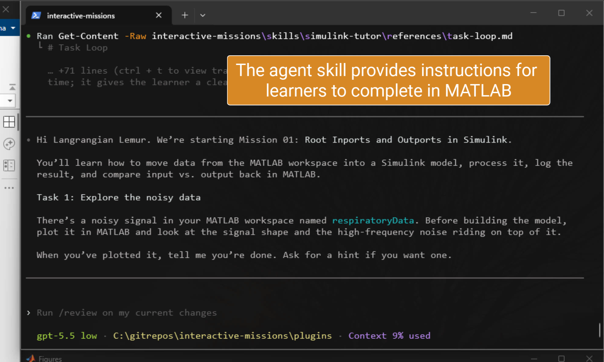
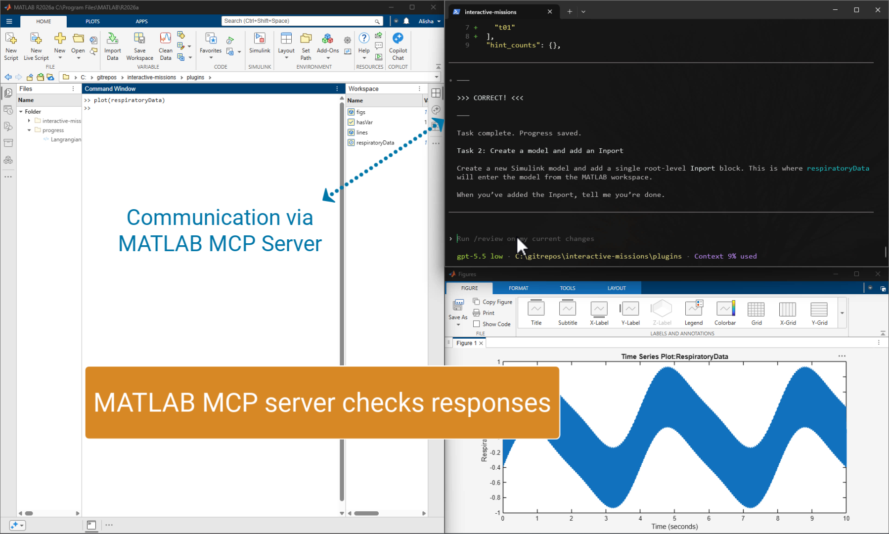
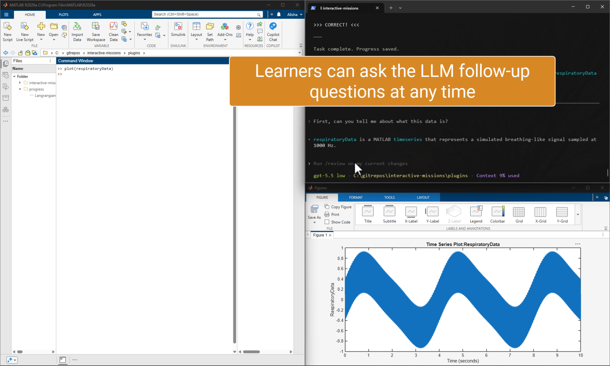
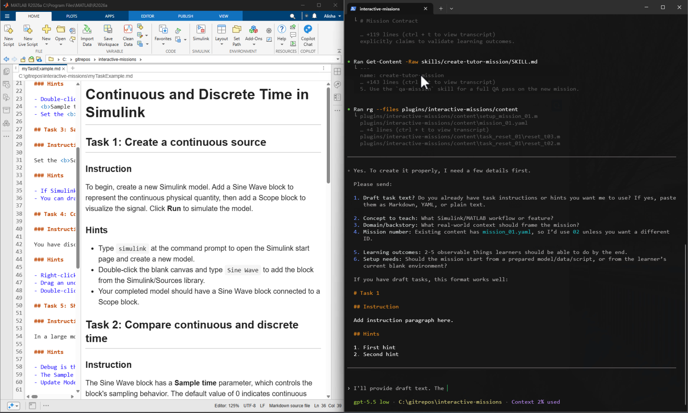
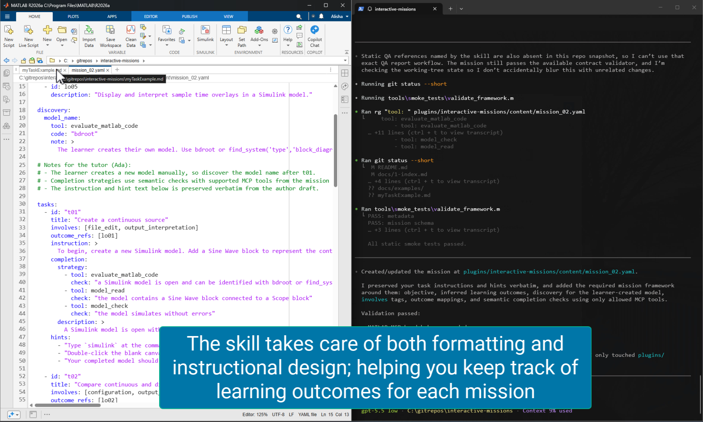
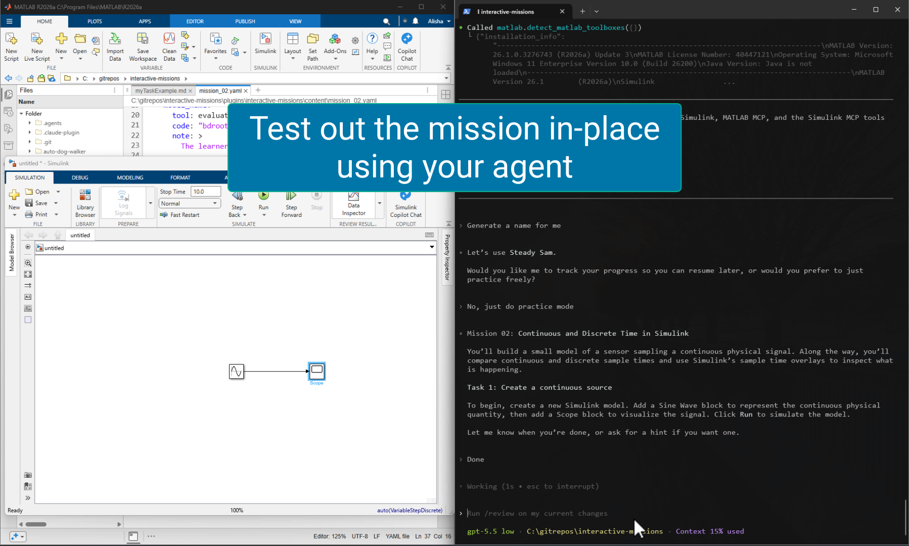

# Interactive Missions in MATLAB and Simulink

Interactive Missions is a **MATLAB toolbox** for learning MATLAB&reg; and Simulink&reg; through guided, hands-on missions. You choose a mission in the MATLAB app, the app prepares a safe workspace, and an agentic tutor named Ada guides you one step at a time.

🧑‍🎓Want to jump in to learning right away? [Start your first mission](#start-your-first-mission)

🧑‍🏫Want to know how to author a mission? See [Getting Started](#getting-started).

## Examples

### Learning

<table>
  <tr>
    <td width="33%">
      
      <br><em>Learners start a prepared mission from their selected agentic client while MATLAB MCP Server is running.</em>
    </td>
    <td width="33%">
      
      <br><em>Missions use MATLAB MCP tools to inspect the learner's MATLAB, Simulink, and connected-product work.</em>
    </td>
    <td width="33%">
      
      <br><em>Learners can ask Ada follow-up questions while they work through a mission.</em>
    </td>
  </tr>
</table>

### Authoring

<table>
  <tr>
    <td width="33%">
      
      <br><em>Use the <code>create-tutor-mission</code> skill to author a marketplace mission from your notes.</em>
    </td>
    <td width="33%">
      
      <br><em>The skill formats the notes into mission metadata and learner tasks.</em>
    </td>
    <td width="33%">
      
      <br><em>Use MATLAB MCP Server and the packaged tutor to test a mission before publication.</em>
    </td>
  </tr>
</table>

## Requirements

To use this repository, you must have:

- A supported agentic client: Codex, Claude Code, Gemini CLI, GitHub Copilot in VS Code, GitHub Copilot CLI, or use the generic adapter. See the shared author-skill [Platform Qualification](src/author-skills/references/platform-qualification.md).
- MATLAB and Simulink versions supported by the toolbox installation. Each mission separately declares its supported MATLAB releases, products, and capabilities; check the selected mission in the app.
- A properly configured [Simulink Agentic Toolkit](https://github.com/matlab/simulink-agentic-toolkit) , which installs the MATLAB MCP Server. (Note that you can also choose to configure MATLAB MCP tools while installing the Simulink Agentic Toolkit.)

# For Learners
## Start Your First Mission

Install [`InteractiveMissions.mltbx`](https://github.com/matlab/agentic-learning-missions/releases/download/v0.0.1/InteractiveMissions.mltbx), then open **Interactive Missions** from the MATLAB Apps Gallery.

**In the app**
1. Pick a mission card.
2. Choose **Start Mission** to begin a mission. This saves your progress so you can **Resume** later. If you don't want to track progress, choose **Practice** instead.
3. Choose an agentic client: Codex, Claude Code, Gemini CLI, GitHub Copilot in VS Code, GitHub Copilot CLI, or Generic.

**In your terminal or agentic desktop app**
1. Follow the app's launch steps to change your current folder to the generated learner workspace. The app provides a terminal/CLI instruction, like
   `cd "C:/Users/<you>/Documents/MATLAB/Interactive-Missions/<mission-name>"`
   If you use a desktop app to launch your agentic client, navigate to that folder in the app.
2. Start the agentic client from that folder and follow the client-specific launch instruction shown by the app. For example, Codex uses `$mission-tutoring`, while other clients use different prompts or workspace instruction files.
3. For a new regular session, Ada asks how you want to be addressed before beginning.

* The optional [Terminal in MATLAB](https://github.com/matlab/terminal-in-matlab) toolbox can make the terminal step easier from inside MATLAB.
### Working through a mission

The instructions above guide you through setup in MATLAB and your agentic client. After invoking the tutor skill with the appropriate `mission-tutoring` instruction shown by the app, you will interact with both the agent and MATLAB/Simulink.
#### In the agent
* Receive background and instruction
* Ask for hints
* Ask follow-up questions
* Check your work
#### In MATLAB/Simulink
* Execute the task
* Self-check by running code or models

These roles are described in the following diagram.


## Tutoring Modes: Regular and Practice

**Regular** mode saves local progress in the learner workspace at `.interactive-missions/progress.json`. If you begin a mission in regular mode, you can use **Resume** in the app to pick up where you left off. Resume uses the app cache to find recent active workspaces, verifies the workspace still exists, and reads the workspace-local progress path from the workspace manifest.

Practice mode is for trying a mission freely. It starts without a progress file, and the mission starts from the beginning next time unless the learner asks Ada to save progress. That opt-in request promotes the current workspace to a resumable session.

## Available Missions

- **Root Inports and Outports** teaches how MATLAB workspace data moves through Simulink root ports.
- **Continuous and Discrete Time** introduces continuous and sampled behavior in Simulink

Open the app catalog for the current mission inventory. The app registers the MathWorks marketplace by default and checks for new revisions at startup. It downloads updated content only when you choose **Refresh**. If a cache is missing, the app attempts to recover it; if a refresh fails, it keeps the last valid cache.

# For Authors

## Getting Started

Install [`InteractiveMissions.mltbx`](https://github.com/matlab/agentic-learning-missions/releases/download/v0.0.1/InteractiveMissions.mltbx), then open **Interactive Missions** from the MATLAB Apps Gallery.

In MATLAB, create a new folder and navigate to it. Then run:

```matlab
startMissionAuthoring()
```

The command sets up a draft marketplace layout, copies author documentation and skills, and configures the supported agentic client selected in the Command Window. It can also create a first-mission brief. Set the `source_url` TODO in `marketplace/manifest.yaml` before publishing or registering the marketplace.

Then, launch your agent from the newly created folder and use `create-tutor-mission` to begin authoring.
## Authoring skills

There are 3 skills to help you author missions:

1. `create-tutor-mission` to draft mission YAML and optional setup scripts.
2. `qa-mission` to review learner flow, setup/reset consistency, completion checks, and app metadata.
3. `maintain-missions` for marketplace layout, documentation, and validation maintenance.

You can create a mission based on just a topic and learning outcomes, a topic plus a list of tasks, or a fully written list of tasks and hints that you want to use verbatim. The `create-tutor-mission` skill will use the information you provide to create mission YAML with all of the required metadata.

## Sharing your missions

To share your missions, push the marketplace to a public or private Git repository. Learners can register an HTTPS, `ssh://`, or SCP-style SSH clone URL. HTTPS authentication uses the configured Git credential helper; SSH URLs use the configured SSH agent.
# About this Repository

- `src/docs/` contains learner-facing Help content, while `docs/` contains author, maintainer, and validation guidance.
- `src/` contains MATLAB APIs, the Apps Gallery app entry point, and `src/app` UIHTML assets.
- `marketplace/` contains marketplace manifests, *mission content*, and assets retrieved into the local marketplace cache.
- `src/adapters/` and `src/skills/mission-tutoring/` contain installed runtime assets. The app copies the learner tutor skill and selected adapter from these paths when starting a mission.
- `src/author-skills/` is the source of truth for author-facing skills and their shared references.
- `buildfile.m` defines the `buildtool package` task that builds `InteractiveMissions.mltbx`. <!--remove this when we update the packaging workflow -->
- `tests/` contains static and MATLAB runtime validators.

## License

The license for this toolbox is available in [LICENSE.MD](LICENSE.md).

© Copyright 2026 The MathWorks, Inc.
